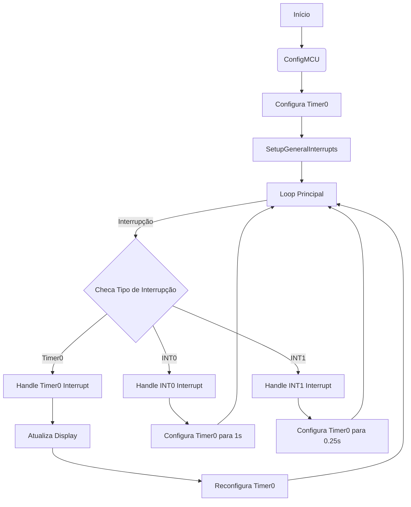
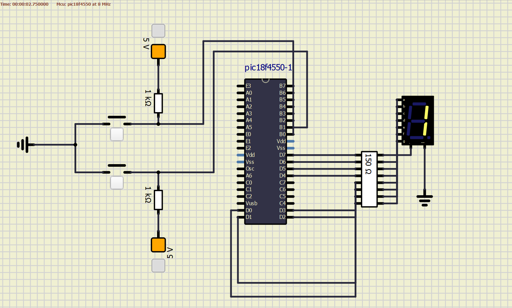

# Cronômetro Digital para Microcontrolador PIC

## Alunos
- Matheus Violaro Bellini (12547600)
- Enzo Serrano Conti (12547147)
- Rafael Freitas Garcia (11222374)
- Beatriz Aimee Teixeira Furtado Braga (12547934)

## Descrição do Projeto

Este projeto implementa um cronômetro digital utilizando um microcontrolador PIC. O software foi projetado para controlar um display de 7 segmentos e responder a interrupções, proporcionando uma contagem de tempo dinâmica e interativa. Ele é composto por rotinas específicas para configuração do microcontrolador, exibição de números no display, gerenciamento de interrupções, e uma lógica principal que sustenta o funcionamento do cronômetro.

Através da utilização de interrupções, o cronômetro é capaz de contar o tempo e reagir a entradas externas, permitindo ajustar a velocidade de contagem. A configuração do microcontrolador é adaptada para os microcontroladores PIC18F4550 e PIC18F45k22, com o foco desta implementação para simulação no software SimulIDE do PIC18F4550.

### Início do programa
No início do programa são declaradas algumas variáveis globais, `contador` para definir a contagem dos números no display, e `TH` e `TL` para definir os valores de `TMR0H` e `TMR0L` do Timer0, respectivamente. Essas variáveis são definidas como globais para que possam ser acessadas pelas rotinas de interrupção.


#### Subrotina _ConfigMCU_

A subrotina `ConfigMCU` é  responsável por configurar os pinos do microcontrolador para que correspondam às necessidades específicas do projeto, como definir portas de entrada e saída e desativar funções desnecessárias. 

No início da subrotina, há uma verificação condicional (`#ifdef PIC18F45K22`) para configurar de maneira diferente se estiver usando o microcontrolador PIC18F45K22. Para este modelo, as funções analógicas nos PORTB e PORTD são desativadas (`ANSELB` e `ANSELD`), e os resistores de pull-up para os botões RB0 e RB1 são ativados (`WPUB.WPUB0` e `WPUB.WPUB1`). Caso contrário, apenas as portas A e B são configuradas como digitais (`ADCON1`).

Em seguida, as configurações gerais são aplicadas: PORTD é configurado como saída (`TRISD = 0`) e inicializado com o valor 0 (`PORTD = 0`), enquanto RB0 e RB1 são configurados como entradas (`TRISB.RB0 = 1` e `TRISB.RB1 = 1`) e inicializados em estado alto (`PORTB.RB0 = 1` e `PORTB.RB1 = 1`).

```c
void ConfigMCU() {
    #ifdef PIC18F45K22
        ANSELB = 0;  // Desativa funções analógicas em PORTB
        ANSELD = 0;  // Desativa funções analógicas em PORTD
        INTCON2.RBPU = 0; // Desabilita resistor de pull-up global
        WPUB.WPUB0 = 1;   // Ativa pull-up para RB0
        WPUB.WPUB1 = 1;   // Ativa pull-up para RB1
    #else
        ADCON1 |= 0x0F;  // Configura PORTA e PORTB como digitais
        INTCON2.RBPU = 0; // Desabilita resistor de pull-up global
    #endif
    TRISD = 0;         // Configura PORTD como saída
    PORTD = 0;         // Inicializa PORTD em 0
    TRISB.RB0 = 1;     // Configura RB0 como entrada
    TRISB.RB1 = 1;     // Configura RB1 como entrada
    PORTB.RB0 = 1;     // Inicializa RB0 em estado alto
    PORTB.RB1 = 1;     // Inicializa RB1 em estado alto
}
```


#### Subrotina _SetupGeneralInterrupts_

A subrotina `SetupGeneralInterrupts` é responsável por configurar as interrupções no microcontrolador. Esta configuração é fundamental para o funcionamento do cronômetro, pois permite que o sistema reaja a eventos externos, como pressionamentos de botão, e execute ações em intervalos de tempo específicos.

Inicialmente, as interrupções de alta e baixa prioridade são habilitadas (`INTCON.GIEH = 1` e `INTCON.GIEL = 1`), juntamente com a priorização de interrupções (`RCON.IPEN = 1`).

Em seguida, para o Timer0, a flag de interrupção é limpa (`INTCON.TMR0IF = 0`) e a interrupção é habilitada (`INTCON.TMR0IE = 1`), sendo definida como de alta prioridade (`INTCON2.TMR0IP = 1`). As interrupções externas INT0 e INT1 são tratadas de maneira semelhante: as flags são limpas (`INTCON.INT0IF = 0` e `INTCON.INT1IF = 0`), as interrupções são habilitadas (`INTCON.INT0IE = 1` e `INTCON3.INT1IE = 1`), e INT1 é configurada como de alta prioridade (`INTCON3.INT1IP = 1`). Por fim, as bordas de subida são definidas para as interrupções externas (`INTCON2.INTEDG0 = 1` e `INTCON2.INTEDG1 = 1`).

O código da subrotina é o seguinte:

```c
void SetupGeneralInterrupts() {
    INTCON.GIEH = 1;   // Habilita interrupções de alta prioridade
    INTCON.GIEL = 1;   // Habilita interrupções de baixa prioridade
    RCON.IPEN = 1;     // Habilita priorização de interrupções

    // Configura interrupções do Timer0
    INTCON.TMR0IF = 0; // Limpa flag do Timer0
    INTCON.TMR0IE = 1; // Habilita interrupção do Timer0
    INTCON2.TMR0IP = 1;// Define Timer0 como alta prioridade

    // Configura interrupções externas
    INTCON.INT0IF = 0; // Limpa flag do INT0
    INTCON.INT1IF = 0; // Limpa flag do INT1
    INTCON.INT0IE = 1; // Habilita interrupção INT0
    INTCON3.INT1IE = 1; // Habilita interrupção INT1
    INTCON3.INT1IP = 1; // Define INT1 como alta prioridade

    // Define bordas de subida para as interrupções externas
    INTCON2.INTEDG0 = 1;
    INTCON2.INTEDG1 = 1;
}
```

#### Subrotina _INTERRUPT_HIGH_

A rotina `INTERRUPT_HIGH` é a função de interrupção de alta prioridade do microcontrolador. Essa rotina é acionada por eventos externos ou pelo Timer0.

Dentro desta rotina, o primeiro bloco de código verifica se a interrupção foi causada pelo Timer0 (`INTCON.TMR0IF == 1`). Se sim, o contador é incrementado. Quando o contador alcança o valor 10, ele é reinicializado para 0, criando um loop de contagem. Em seguida, o display é atualizado com o valor atual do contador, e o Timer0 é reconfigurado com os valores pré-definidos em `TH` e `TL`, antes de reativar o Timer0 e limpar a flag de interrupção.

O segundo bloco de código trata da interrupção do botão INT0 (RB0). Quando essa interrupção ocorre, o Timer0 é reconfigurado para gerar um intervalo de 1 segundo (valores definidos em `TH` e `TL`), permitindo ajustar a velocidade de contagem do cronômetro.

O terceiro e último bloco lida com a interrupção do botão INT1 (RB1). De maneira similar ao INT0, esta interrupção reconfigura o Timer0, mas para um intervalo de 0.25 segundo, oferecendo outra opção de velocidade de contagem.

O código da rotina é o seguinte:

```c
void INTERRUPT_HIGH() iv 0x0008 ics ICS_AUTO {
    // Trata interrupção do Timer0
    if (INTCON.TMR0IF == 1) {
        contador++;  // Incrementa o contador
        if (contador >= 10) contador = 0; // Reseta se alcançar 10

        display(contador);  // Atualiza o display

        // Reinicializa o Timer0
        T0CON.TMR0ON = 0;   // Desativa temporariamente para configuração
        TMR0H = TH;         // Configura valor alto
        TMR0L = TL;         // Configura valor baixo
        T0CON.TMR0ON = 1;   // Reativa o Timer0

        INTCON.TMR0IF = 0;  // Limpa a flag de interrupção
    }

    // Trata interrupção do botão INT0 (RB0)
    if (INTCON.INT0IF == 1) {
        // Configura Timer0 para 1 segundo
        TH = 0x0B;
        TL = 0xDC;

        // Reinicializa o Timer0
        T0CON.TMR0ON = 0; 
        TMR0H = TH; 
        TMR0L = TL; 
        T0CON.TMR0ON = 1;
        INTCON.INT0IF = 0;  // Limpa a flag de interrupção
    }

    // Trata interrupção do botão INT1 (RB1)
    if (INTCON3.INT1IF == 1) {
        // Configura Timer0 para 0.25 segundo
        TH = 0xC2; 
        TL = 0xF7;
        
        // Reinicializa o Timer0
        T0CON.TMR0ON = 0;
        TMR0H = TH; 
        TMR0L = TL; 
        T0CON.TMR0ON = 1;
        INTCON3.INT1IF = 0; // Limpa a flag de interrupção
    }
}
```

#### Função _main_

A função `main` é responsável por chamar as subrotinas de configuração do microcontrolador e das interrupções, bem como manter o programa em um loop contínuo, permitindo que as interrupções gerenciem a maior parte da funcionalidade do cronômetro.

Inicialmente, `main` chama `ConfigMCU`, que configura o estado inicial dos pinos e portas do microcontrolador. Em seguida, as configurações específicas do Timer0 são estabelecidas em `T0CON`. Após isso, `SetupGeneralInterrupts` é chamada para configurar as interrupções necessárias para a operação do cronômetro.

O loop principal do programa (`while(1)`) bastante simples, pois a maior parte do trabalho é feita pelas rotinas de interrupção.

O código da função é o seguinte:

```c
void main() {
    ConfigMCU();  // Inicializa o microcontrolador com as configurações específicas

    T0CON = 0B00000100; // Configurações do Timer0

    SetupGeneralInterrupts();  // Configura as interrupções gerais

    // Loop principal do programa
    while(1) {
        // O loop principal permite a execução de outras tarefas ou estados de baixo consumo
        // A maior parte da funcionalidade é gerenciada pelas rotinas de interrupção
    }
}
```

## Fluxograma e imagens

Um fluxograma representando a interação entre os blocos de código do programa e as interrupções geradas pelos botões e pelo timer é representado abaixo:



Além disso, o esquema de montagem da simualação na SimmulIDE é representado abaixo:




## Comparação entre Implementações de Cronômetro Digital

Uma pequena comparação de algumas vantagens de se implementar um cronômetro digital em Assembly para o microcontrolador 8051 e em C para o microcontrolador PIC é apresentada abaixo:

### C para PIC
**Vantagens:**
- **Legibilidade e Manutenção:** O código em C é mais legível e fácil de manter.
- **Portabilidade:** Mais fácil de adaptar para diferentes microcontroladores PIC.
- **Abstração de Hardware:** Menos foco em detalhes de hardware específicos.

**Desvantagens:**
- **Eficiência de Execução:** Pode ser menos eficiente que Assembly em termos de tempo de execução e uso de memória.
- **Controle de Hardware:** Menos controle direto sobre o hardware.

### Assembly para 8051
**Vantagens:**
- **Eficiência:** Pode ser mais eficiente em termos de uso de memória e tempo de execução (dependendo da implementação).
- **Controle Direto:** Permite controle detalhado e preciso do hardware.

**Desvantagens:**
- **Legibilidade e Manutenção:** Menos legível e mais difícil de manter do que o código em C.
- **Portabilidade:** Baixa portabilidade para outros microcontroladores.
- **Complexidade:** Maior complexidade em desenvolvimento e depuração.